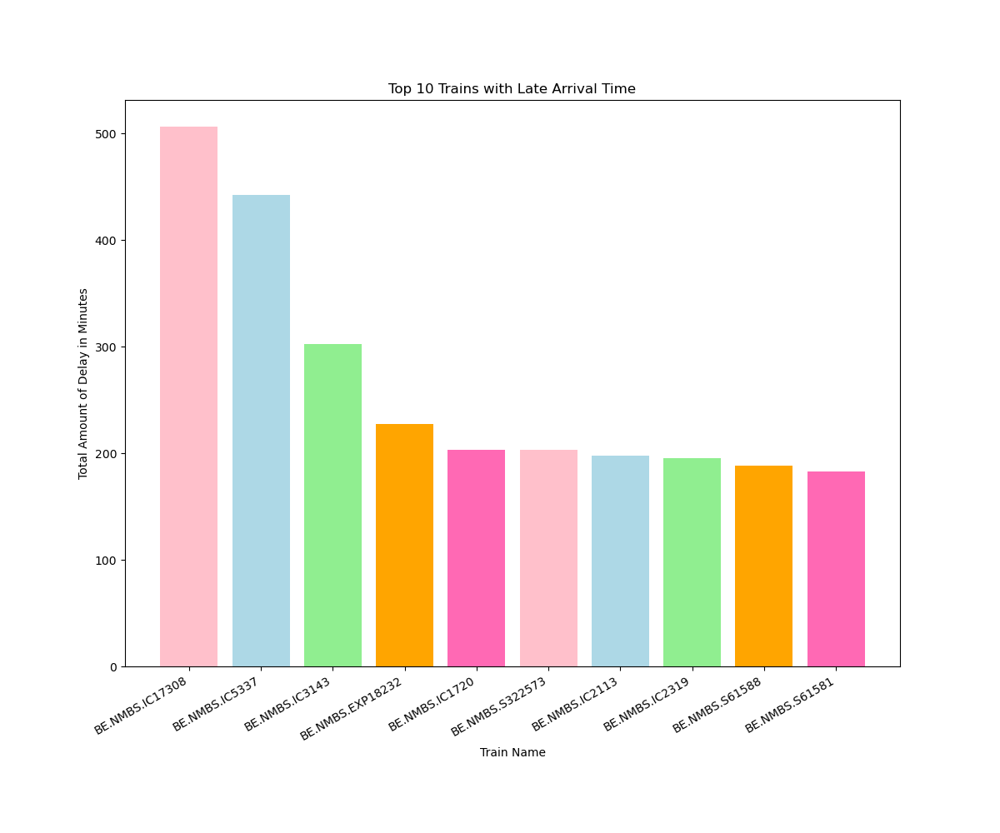
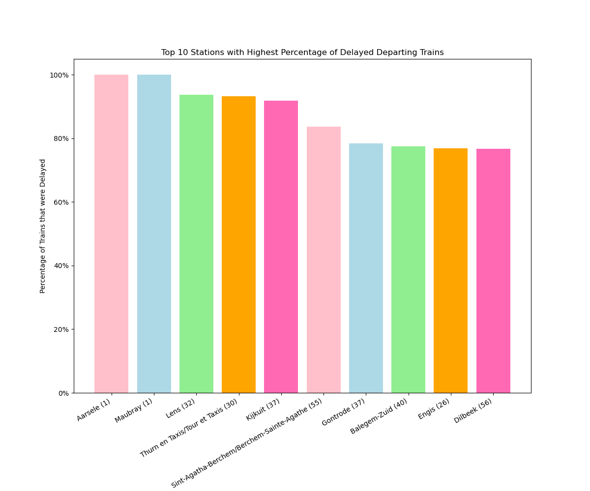
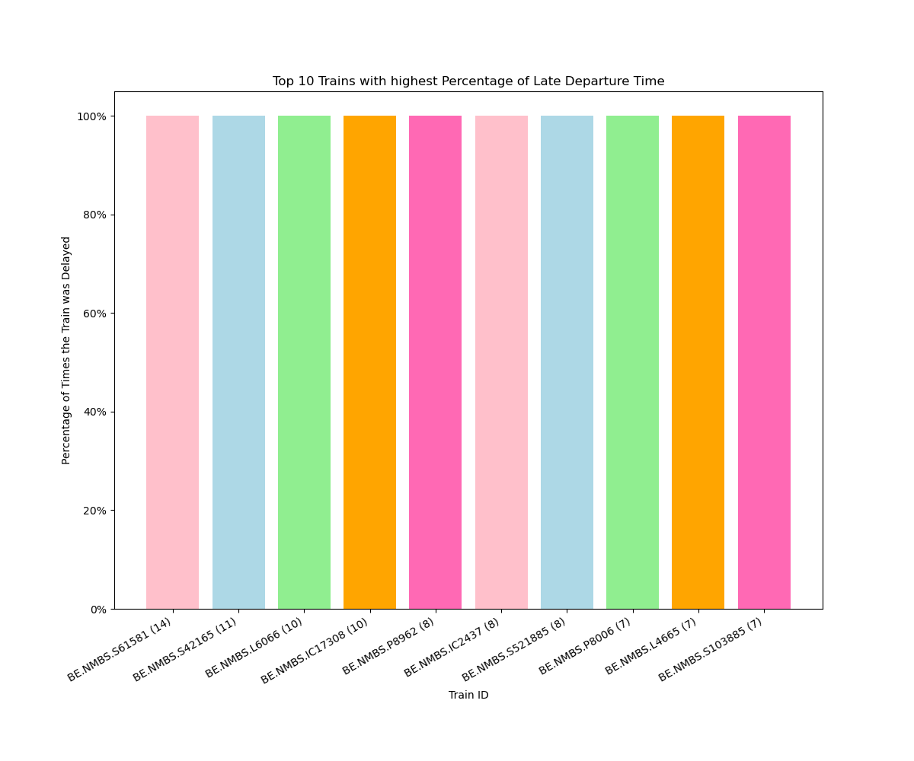
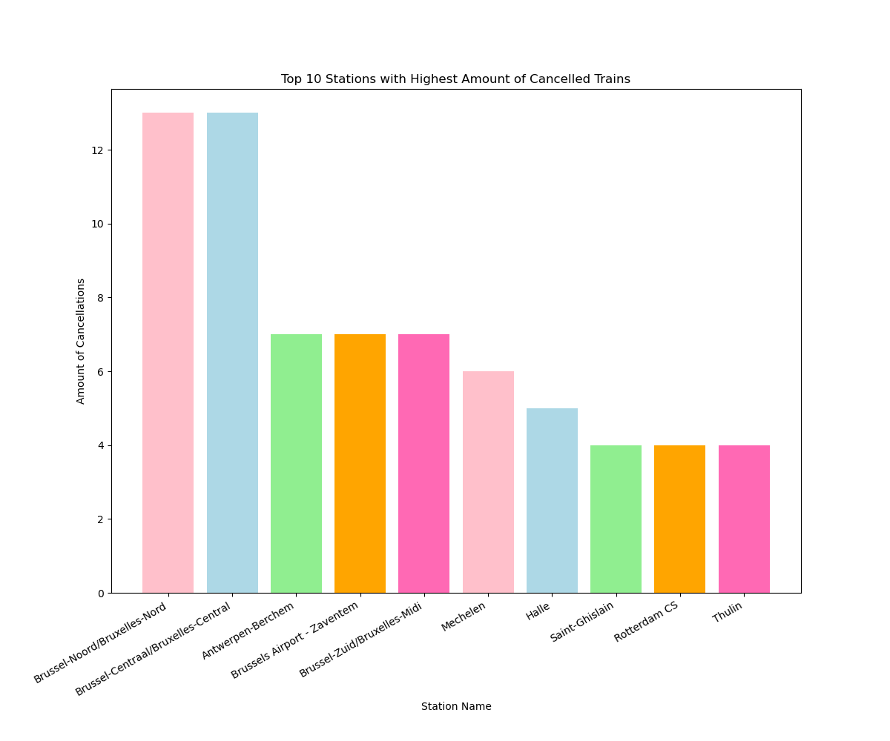
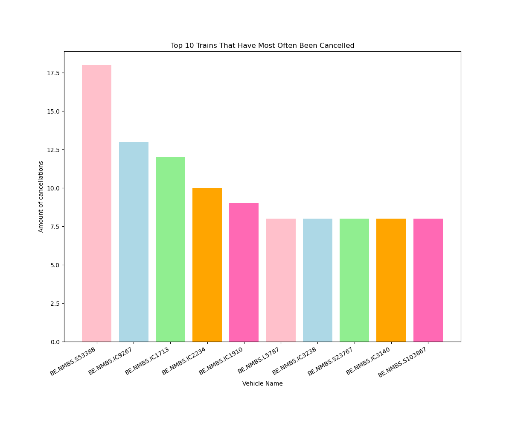
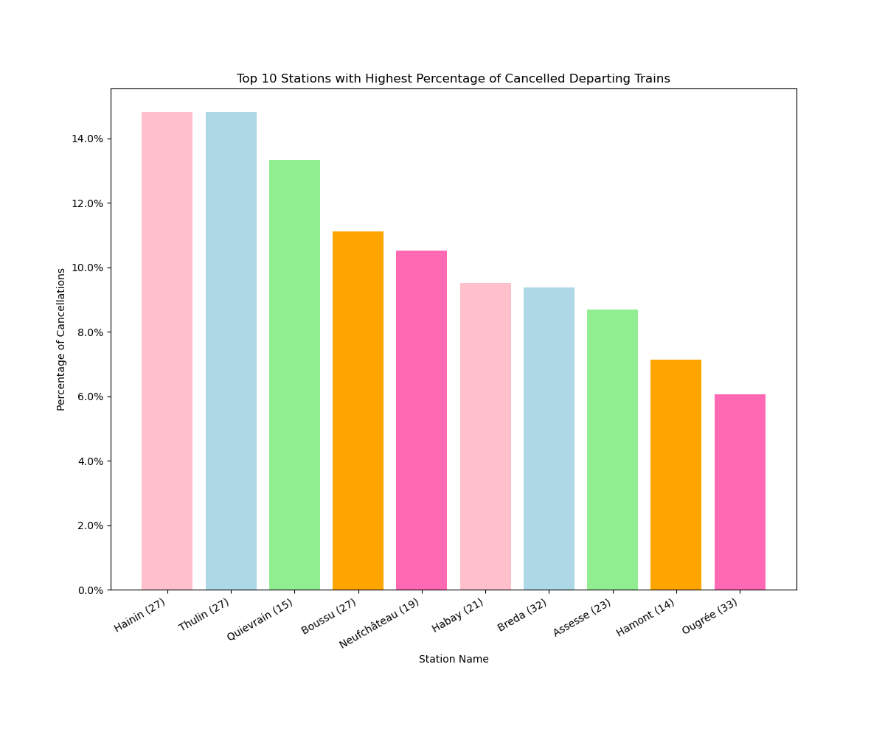
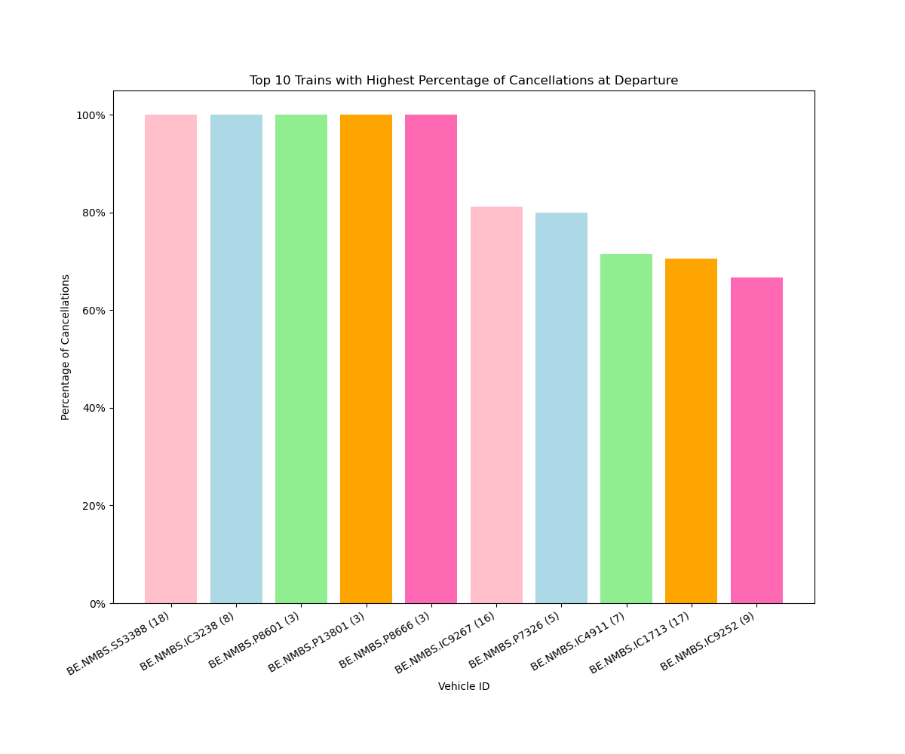

# Belgian Railway Statistics

Some information about delays and cancellations from 2024-07-30 19:55:00 until 2024-08-19 22:35:00 generated on Mon Aug 19 11:37:25 PM CEST 2024.

## Density map of all departures per station

## Delays

### Absolute

#### Top 10 stations with late departures

Lorem ipsum dolor sit amet, consectetur adipiscing elit, sed do eiusmod tempor incididunt ut labore et dolore magna aliqua. Malesuada fames ac turpis egestas. Ornare arcu dui vivamus arcu felis bibendum. Arcu vitae elementum curabitur vitae nunc sed velit dignissim sodales. In fermentum posuere urna nec tincidunt praesent. Ac tincidunt vitae semper quis lectus nulla at volutpat. Ut venenatis tellus in metus vulputate. In ante metus dictum at tempor commodo ullamcorper a. Nulla at volutpat diam ut venenatis tellus in. Ut ornare lectus sit amet est placerat in egestas erat. Viverra justo nec ultrices dui. Dignissim diam quis enim lobortis scelerisque. Ut sem nulla pharetra diam sit amet. Mauris sit amet massa vitae tortor condimentum lacinia quis vel. Pharetra convallis posuere morbi leo urna. Duis ut diam quam nulla portitor massa id neque. Integer feugiat scelerisque varius morbi enim. Eu volutpat odio facilisis mauris sit amet massa vitae tortor. Risus ultricies tristique nulla aliquet enim tortor at auctor urna. Ridiculus mus mauris vitae ultricies.

| Station Name | Total Amount of Delay in Minutes |
| ------------ | -------------------------------- |
| Brussel-Zuid/Bruxelles-Midi | 868.0 |
| Brussel-Centraal/Bruxelles-Central | 838.0 |
| Brussel-Noord/Bruxelles-Nord | 799.0 |
| Antwerpen-Berchem | 355.0 |
| Liège-Guillemins | 345.0 |
| Mechelen | 315.0 |
| Leuven | 253.0 |
| Brussels Airport - Zaventem | 222.0 |
| Namur | 211.0 |
| Antwerpen-Centraal | 180.0 |

#### Top 10 stations with late arrivals

Lorem ipsum dolor sit amet, consectetur adipiscing elit, sed do eiusmod tempor incididunt ut labore et dolore magna aliqua. Malesuada fames ac turpis egestas. Ornare arcu dui vivamus arcu felis bibendum. Arcu vitae elementum curabitur vitae nunc sed velit dignissim sodales. In fermentum posuere urna nec tincidunt praesent. Ac tincidunt vitae semper quis lectus nulla at volutpat. Ut venenatis tellus in metus vulputate. In ante metus dictum at tempor commodo ullamcorper a. Nulla at volutpat diam ut venenatis tellus in. Ut ornare lectus sit amet est placerat in egestas erat. Viverra justo nec ultrices dui. Dignissim diam quis enim lobortis scelerisque. Ut sem nulla pharetra diam sit amet. Mauris sit amet massa vitae tortor condimentum lacinia quis vel. Pharetra convallis posuere morbi leo urna. Duis ut diam quam nulla portitor massa id neque. Integer feugiat scelerisque varius morbi enim. Eu volutpat odio facilisis mauris sit amet massa vitae tortor. Risus ultricies tristique nulla aliquet enim tortor at auctor urna. Ridiculus mus mauris vitae ultricies.

| Station Name | Total Amount of Delay in Minutes |
| ------------ | -------------------------------- |
| Antwerpen-Centraal | 1859.0 |
| Brussel-Zuid/Bruxelles-Midi | 1473.0 |
| Liège-Guillemins | 1314.0 |
| Dendermonde | 932.0 |
| Aalst | 899.0 |
| Leuven | 797.0 |
| Zottegem | 691.0 |
| Namur | 688.0 |
| Oostende | 669.0 |
| Brussels Airport - Zaventem | 641.0 |

#### Top 10 trains with late departures

Lorem ipsum dolor sit amet, consectetur adipiscing elit, sed do eiusmod tempor incididunt ut labore et dolore magna aliqua. Malesuada fames ac turpis egestas. Ornare arcu dui vivamus arcu felis bibendum. Arcu vitae elementum curabitur vitae nunc sed velit dignissim sodales. In fermentum posuere urna nec tincidunt praesent. Ac tincidunt vitae semper quis lectus nulla at volutpat. Ut venenatis tellus in metus vulputate. In ante metus dictum at tempor commodo ullamcorper a. Nulla at volutpat diam ut venenatis tellus in. Ut ornare lectus sit amet est placerat in egestas erat. Viverra justo nec ultrices dui. Dignissim diam quis enim lobortis scelerisque. Ut sem nulla pharetra diam sit amet. Mauris sit amet massa vitae tortor condimentum lacinia quis vel. Pharetra convallis posuere morbi leo urna. Duis ut diam quam nulla portitor massa id neque. Integer feugiat scelerisque varius morbi enim. Eu volutpat odio facilisis mauris sit amet massa vitae tortor. Risus ultricies tristique nulla aliquet enim tortor at auctor urna. Ridiculus mus mauris vitae ultricies.

| Train Name | Total Amount of Delay in Minutes |
| ---------- | -------------------------------- |
| BE.NMBS.IC17308 | 506.0 |
| BE.NMBS.IC5337 | 442.0 |
| BE.NMBS.IC3143 | 302.0 |
| BE.NMBS.EXP18232 | 227.0 |
| BE.NMBS.IC1720 | 203.0 |
| BE.NMBS.S322573 | 203.0 |
| BE.NMBS.IC2113 | 198.0 |
| BE.NMBS.IC2319 | 195.0 |
| BE.NMBS.S61588 | 188.0 |
| BE.NMBS.S61581 | 183.0 |

### Relative

#### Top 10 stations with late departures compared to amount of departing trains

Lorem ipsum dolor sit amet, consectetur adipiscing elit, sed do eiusmod tempor incididunt ut labore et dolore magna aliqua. Malesuada fames ac turpis egestas. Ornare arcu dui vivamus arcu felis bibendum. Arcu vitae elementum curabitur vitae nunc sed velit dignissim sodales. In fermentum posuere urna nec tincidunt praesent. Ac tincidunt vitae semper quis lectus nulla at volutpat. Ut venenatis tellus in metus vulputate. In ante metus dictum at tempor commodo ullamcorper a. Nulla at volutpat diam ut venenatis tellus in. Ut ornare lectus sit amet est placerat in egestas erat. Viverra justo nec ultrices dui. Dignissim diam quis enim lobortis scelerisque. Ut sem nulla pharetra diam sit amet. Mauris sit amet massa vitae tortor condimentum lacinia quis vel. Pharetra convallis posuere morbi leo urna. Duis ut diam quam nulla portitor massa id neque. Integer feugiat scelerisque varius morbi enim. Eu volutpat odio facilisis mauris sit amet massa vitae tortor. Risus ultricies tristique nulla aliquet enim tortor at auctor urna. Ridiculus mus mauris vitae ultricies.

| Station Name | Percentage of Trains that were Delayed |
| ------------ | -------------------------------------- |
| Aarsele (1) | 1.0 |
| Maubray (1) | 1.0 |
| Lens (32) | 0.9375 |
| Thurn en Taxis/Tour et Taxis (30) | 0.9333 |
| Kijkuit (37) | 0.9189 |
| Sint-Agatha-Berchem/Berchem-Sainte-Agathe (55) | 0.8364 |
| Gontrode (37) | 0.7838 |
| Balegem-Zuid (40) | 0.775 |
| Engis (26) | 0.7692 |
| Dilbeek (56) | 0.7679 |

#### Top 10 stations with late arrivals compared to amount of arriving trains

Lorem ipsum dolor sit amet, consectetur adipiscing elit, sed do eiusmod tempor incididunt ut labore et dolore magna aliqua. Malesuada fames ac turpis egestas. Ornare arcu dui vivamus arcu felis bibendum. Arcu vitae elementum curabitur vitae nunc sed velit dignissim sodales. In fermentum posuere urna nec tincidunt praesent. Ac tincidunt vitae semper quis lectus nulla at volutpat. Ut venenatis tellus in metus vulputate. In ante metus dictum at tempor commodo ullamcorper a. Nulla at volutpat diam ut venenatis tellus in. Ut ornare lectus sit amet est placerat in egestas erat. Viverra justo nec ultrices dui. Dignissim diam quis enim lobortis scelerisque. Ut sem nulla pharetra diam sit amet. Mauris sit amet massa vitae tortor condimentum lacinia quis vel. Pharetra convallis posuere morbi leo urna. Duis ut diam quam nulla portitor massa id neque. Integer feugiat scelerisque varius morbi enim. Eu volutpat odio facilisis mauris sit amet massa vitae tortor. Risus ultricies tristique nulla aliquet enim tortor at auctor urna. Ridiculus mus mauris vitae ultricies.

| Station Name | Percentage of Trains that were Delayed |
| ------------ | -------------------------------------- |
| Aéroport Charles-de-Gaulle TGV (1) | 1.0 |
| Huy (5) | 0.8 |
| Jemeppe-sur-Sambre (12) | 0.6667 |
| Jurbeke (24) | 0.5417 |
| Aalst (669) | 0.4978 |
| Denderleeuw (92) | 0.4457 |
| Roosendaal (303) | 0.4455 |
| Dendermonde (784) | 0.4235 |
| Geraardsbergen (587) | 0.3816 |
| Puurs (391) | 0.3734 |

#### Top 10 trains with late departures

Lorem ipsum dolor sit amet, consectetur adipiscing elit, sed do eiusmod tempor incididunt ut labore et dolore magna aliqua. Malesuada fames ac turpis egestas. Ornare arcu dui vivamus arcu felis bibendum. Arcu vitae elementum curabitur vitae nunc sed velit dignissim sodales. In fermentum posuere urna nec tincidunt praesent. Ac tincidunt vitae semper quis lectus nulla at volutpat. Ut venenatis tellus in metus vulputate. In ante metus dictum at tempor commodo ullamcorper a. Nulla at volutpat diam ut venenatis tellus in. Ut ornare lectus sit amet est placerat in egestas erat. Viverra justo nec ultrices dui. Dignissim diam quis enim lobortis scelerisque. Ut sem nulla pharetra diam sit amet. Mauris sit amet massa vitae tortor condimentum lacinia quis vel. Pharetra convallis posuere morbi leo urna. Duis ut diam quam nulla portitor massa id neque. Integer feugiat scelerisque varius morbi enim. Eu volutpat odio facilisis mauris sit amet massa vitae tortor. Risus ultricies tristique nulla aliquet enim tortor at auctor urna. Ridiculus mus mauris vitae ultricies.

| Train Name | Percentage of Trips on which the Train was Delayed |
| ---------- | -------------------------------------------------- |
| BE.NMBS.S61581 (14) | 1.0 |
| BE.NMBS.S42165 (11) | 1.0 |
| BE.NMBS.L6066 (10) | 1.0 |
| BE.NMBS.IC17308 (10) | 1.0 |
| BE.NMBS.P8962 (8) | 1.0 |
| BE.NMBS.IC2437 (8) | 1.0 |
| BE.NMBS.S521885 (8) | 1.0 |
| BE.NMBS.P8006 (7) | 1.0 |
| BE.NMBS.L4665 (7) | 1.0 |
| BE.NMBS.S103885 (7) | 1.0 |

## Cancellations

### Absolute

#### Top 10 stations with cancellations at departure

Lorem ipsum dolor sit amet, consectetur adipiscing elit, sed do eiusmod tempor incididunt ut labore et dolore magna aliqua. Malesuada fames ac turpis egestas. Ornare arcu dui vivamus arcu felis bibendum. Arcu vitae elementum curabitur vitae nunc sed velit dignissim sodales. In fermentum posuere urna nec tincidunt praesent. Ac tincidunt vitae semper quis lectus nulla at volutpat. Ut venenatis tellus in metus vulputate. In ante metus dictum at tempor commodo ullamcorper a. Nulla at volutpat diam ut venenatis tellus in. Ut ornare lectus sit amet est placerat in egestas erat. Viverra justo nec ultrices dui. Dignissim diam quis enim lobortis scelerisque. Ut sem nulla pharetra diam sit amet. Mauris sit amet massa vitae tortor condimentum lacinia quis vel. Pharetra convallis posuere morbi leo urna. Duis ut diam quam nulla portitor massa id neque. Integer feugiat scelerisque varius morbi enim. Eu volutpat odio facilisis mauris sit amet massa vitae tortor. Risus ultricies tristique nulla aliquet enim tortor at auctor urna. Ridiculus mus mauris vitae ultricies.

| Station Name | Total Amount of Cancellations |
| ------------ | ----------------------------- |
| Brussel-Noord/Bruxelles-Nord | 13.0 |
| Brussel-Centraal/Bruxelles-Central | 13.0 |
| Antwerpen-Berchem | 7.0 |
| Brussels Airport - Zaventem | 7.0 |
| Brussel-Zuid/Bruxelles-Midi | 7.0 |
| Mechelen | 6.0 |
| Halle | 5.0 |
| Saint-Ghislain | 4.0 |
| Rotterdam CS | 4.0 |
| Thulin | 4.0 |

#### Top 10 trains with cancellations

Lorem ipsum dolor sit amet, consectetur adipiscing elit, sed do eiusmod tempor incididunt ut labore et dolore magna aliqua. Malesuada fames ac turpis egestas. Ornare arcu dui vivamus arcu felis bibendum. Arcu vitae elementum curabitur vitae nunc sed velit dignissim sodales. In fermentum posuere urna nec tincidunt praesent. Ac tincidunt vitae semper quis lectus nulla at volutpat. Ut venenatis tellus in metus vulputate. In ante metus dictum at tempor commodo ullamcorper a. Nulla at volutpat diam ut venenatis tellus in. Ut ornare lectus sit amet est placerat in egestas erat. Viverra justo nec ultrices dui. Dignissim diam quis enim lobortis scelerisque. Ut sem nulla pharetra diam sit amet. Mauris sit amet massa vitae tortor condimentum lacinia quis vel. Pharetra convallis posuere morbi leo urna. Duis ut diam quam nulla portitor massa id neque. Integer feugiat scelerisque varius morbi enim. Eu volutpat odio facilisis mauris sit amet massa vitae tortor. Risus ultricies tristique nulla aliquet enim tortor at auctor urna. Ridiculus mus mauris vitae ultricies.

| Train Name | Total Amount of Cancellations |
| ---------- | ----------------------------- |
| BE.NMBS.S53388 | 18.0 |
| BE.NMBS.IC9267 | 13.0 |
| BE.NMBS.IC1713 | 12.0 |
| BE.NMBS.IC2234 | 10.0 |
| BE.NMBS.IC1910 | 9.0 |
| BE.NMBS.L5787 | 8.0 |
| BE.NMBS.IC3238 | 8.0 |
| BE.NMBS.S23767 | 8.0 |
| BE.NMBS.IC3140 | 8.0 |
| BE.NMBS.S103867 | 8.0 |

### Relative

#### Top 10 stations with cancellations at departure

Lorem ipsum dolor sit amet, consectetur adipiscing elit, sed do eiusmod tempor incididunt ut labore et dolore magna aliqua. Malesuada fames ac turpis egestas. Ornare arcu dui vivamus arcu felis bibendum. Arcu vitae elementum curabitur vitae nunc sed velit dignissim sodales. In fermentum posuere urna nec tincidunt praesent. Ac tincidunt vitae semper quis lectus nulla at volutpat. Ut venenatis tellus in metus vulputate. In ante metus dictum at tempor commodo ullamcorper a. Nulla at volutpat diam ut venenatis tellus in. Ut ornare lectus sit amet est placerat in egestas erat. Viverra justo nec ultrices dui. Dignissim diam quis enim lobortis scelerisque. Ut sem nulla pharetra diam sit amet. Mauris sit amet massa vitae tortor condimentum lacinia quis vel. Pharetra convallis posuere morbi leo urna. Duis ut diam quam nulla portitor massa id neque. Integer feugiat scelerisque varius morbi enim. Eu volutpat odio facilisis mauris sit amet massa vitae tortor. Risus ultricies tristique nulla aliquet enim tortor at auctor urna. Ridiculus mus mauris vitae ultricies.

| Station Name | Percentage of Trains that were Cancelled |
| ------------ | ---------------------------------------- |
| Hainin (27) | 0.1481 |
| Thulin (27) | 0.1481 |
| Quievrain (15) | 0.1333 |
| Boussu (27) | 0.1111 |
| Neufchâteau (19) | 0.1053 |
| Habay (21) | 0.0952 |
| Breda (32) | 0.0938 |
| Assesse (23) | 0.087 |
| Hamont (14) | 0.0714 |
| Ougrée (33) | 0.0606 |

#### Top 10 trains with cancellations

Lorem ipsum dolor sit amet, consectetur adipiscing elit, sed do eiusmod tempor incididunt ut labore et dolore magna aliqua. Malesuada fames ac turpis egestas. Ornare arcu dui vivamus arcu felis bibendum. Arcu vitae elementum curabitur vitae nunc sed velit dignissim sodales. In fermentum posuere urna nec tincidunt praesent. Ac tincidunt vitae semper quis lectus nulla at volutpat. Ut venenatis tellus in metus vulputate. In ante metus dictum at tempor commodo ullamcorper a. Nulla at volutpat diam ut venenatis tellus in. Ut ornare lectus sit amet est placerat in egestas erat. Viverra justo nec ultrices dui. Dignissim diam quis enim lobortis scelerisque. Ut sem nulla pharetra diam sit amet. Mauris sit amet massa vitae tortor condimentum lacinia quis vel. Pharetra convallis posuere morbi leo urna. Duis ut diam quam nulla portitor massa id neque. Integer feugiat scelerisque varius morbi enim. Eu volutpat odio facilisis mauris sit amet massa vitae tortor. Risus ultricies tristique nulla aliquet enim tortor at auctor urna. Ridiculus mus mauris vitae ultricies.

| Train Name | Percentage of Trips that were Cancelled |
| ---------- | --------------------------------------- |
| BE.NMBS.S53388 (18) | 1.0 |
| BE.NMBS.IC3238 (8) | 1.0 |
| BE.NMBS.P8601 (3) | 1.0 |
| BE.NMBS.P13801 (3) | 1.0 |
| BE.NMBS.P8666 (3) | 1.0 |
| BE.NMBS.IC9267 (16) | 0.8125 |
| BE.NMBS.P7326 (5) | 0.8 |
| BE.NMBS.IC4911 (7) | 0.7143 |
| BE.NMBS.IC1713 (17) | 0.7059 |
| BE.NMBS.IC9252 (9) | 0.6667 |

