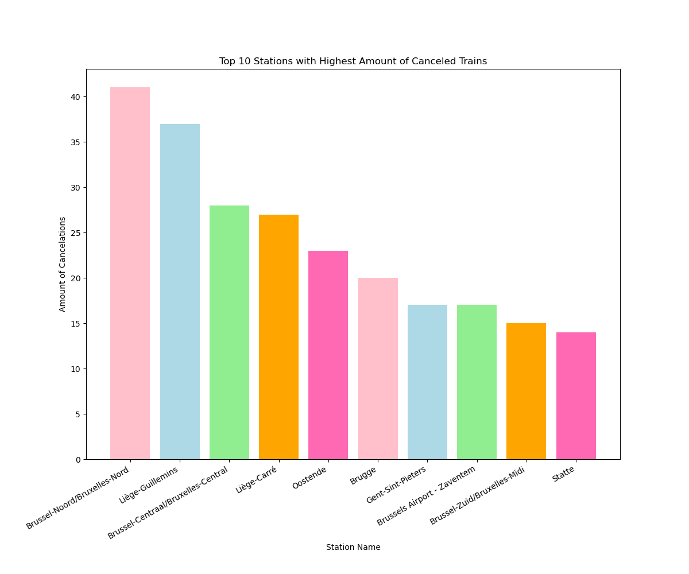
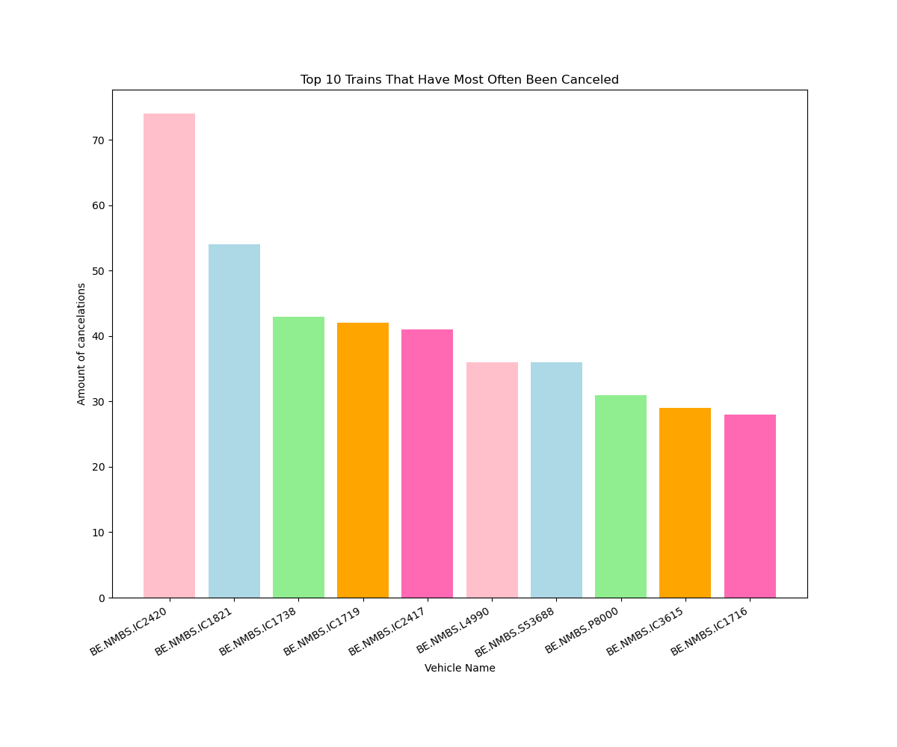

# Belgian Railway Statistics

Some information about delays and cancelations from 2023-12-10 04:01:25 until 2023-12-17 18:21:42.

## Delays

### Top 10 stations with late departures

| Station Name | Total Amount of Delay in Minutes |
| ------------ | -------------------------------- |
| Brussel-Noord/Bruxelles-Nord | 3006.0 |
| Brussel-Centraal/Bruxelles-Central | 2441.0 |
| Brussel-Zuid/Bruxelles-Midi | 1797.0 |
| Namur | 1329.0 |
| Gent-Sint-Pieters | 1242.0 |
| Brussel-Schuman/Bruxelles-Schuman | 1060.0 |
| Liège-Guillemins | 1027.0 |
| Gembloux | 1012.0 |
| Antwerpen-Berchem | 986.0 |
| Ottignies | 981.0 |

### Top 10 stations with late arrivals

| Station Name | Total Amount of Delay in Minutes |
| ------------ | -------------------------------- |
{table_late_arr}

### Top 10 trains with late departures

| Train Name   | Total Amount of Delay in Minutes |
| ------------ | -------------------------------- |
{table_late_tr}

## Cancelations

### Top 10 stations with cancelations at departure

| Station Name | Total Amount of Cancelations |
| ------------ | ---------------------------- |
{table_can_dep}

### Top 10 trains with cancelations

| Train Name | Total Amount of Cancelations |
| ---------- | ---------------------------- |
{table_can_tr}

