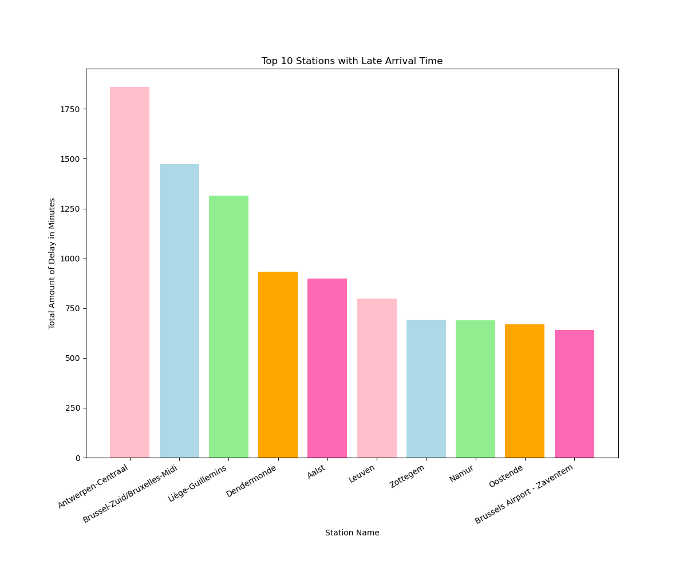

# Belgian Railway Statistics

Some information about delays and cancelations from 2023-12-10 04:01:25 until 2023-12-17 18:21:42.

## Delays

### Top 10 stations with late departures

| Station Name | Total Amount of Delay in Minutes |
| ------------ | -------------------------------- |
| Brussel-Noord/Bruxelles-Nord | 3006.0 |
| Brussel-Centraal/Bruxelles-Central | 2441.0 |
| Brussel-Zuid/Bruxelles-Midi | 1797.0 |
| Namur | 1329.0 |
| Gent-Sint-Pieters | 1242.0 |
| Brussel-Schuman/Bruxelles-Schuman | 1060.0 |
| Liège-Guillemins | 1027.0 |
| Gembloux | 1012.0 |
| Antwerpen-Berchem | 986.0 |
| Ottignies | 981.0 |

### Top 10 stations with late arrivals

| Station Name | Total Amount of Delay in Minutes |
| ------------ | -------------------------------- |
| Brussel-Zuid/Bruxelles-Midi | 10587.0 |
| Antwerpen-Centraal | 7287.0 |
| Liège-Guillemins | 4430.0 |
| Leuven | 3510.0 |
| Mechelen | 3488.0 |
| Mons | 2483.0 |
| Hasselt | 2181.0 |
| Gent-Sint-Pieters | 2167.0 |
| Namur | 2101.0 |
| Charleroi-Central | 2073.0 |

### Top 10 trains with late departures

| Train Name   | Total Amount of Delay in Minutes |
| ------------ | -------------------------------- |
| BE.NMBS.IC2138 | 3565.0 |
| BE.NMBS.L570 | 2929.0 |
| BE.NMBS.S11766 | 2069.0 |
| BE.NMBS.L4967 | 1268.0 |
| BE.NMBS.L4989 | 994.0 |
| BE.NMBS.IC404 | 964.0 |
| BE.NMBS.IC2517 | 949.0 |
| BE.NMBS.IC2438 | 933.0 |
| BE.NMBS.IC726 | 930.0 |
| BE.NMBS.IC4320 | 868.0 |

## Cancelations

### Top 10 stations with cancelations at departure

| Station Name | Total Amount of Cancelations |
| ------------ | ---------------------------- |
(Brussel-Noord/Bruxelles-Nord | 34)
(Liège-Guillemins | 31)
(Brussel-Centraal/Bruxelles-Central | 28)
(Liège-Carré | 27)
(Oostende | 23)
(Brugge | 20)
(Gent-Sint-Pieters | 17)
(Brussels Airport - Zaventem | 17)
(Statte | 14)
(Flemalle-Haute | 14)

### Top 10 trains with cancelations

| Train Name | Total Amount of Cancelations |
| ---------- | ---------------------------- |
(BE.NMBS.IC2420 | 74)
(BE.NMBS.IC1821 | 54)
(BE.NMBS.IC1738 | 43)
(BE.NMBS.IC1719 | 42)
(BE.NMBS.IC2417 | 41)
(BE.NMBS.L4990 | 36)
(BE.NMBS.S53688 | 36)
(BE.NMBS.IC3615 | 29)
(BE.NMBS.P8000 | 29)
(BE.NMBS.IC1716 | 28)

