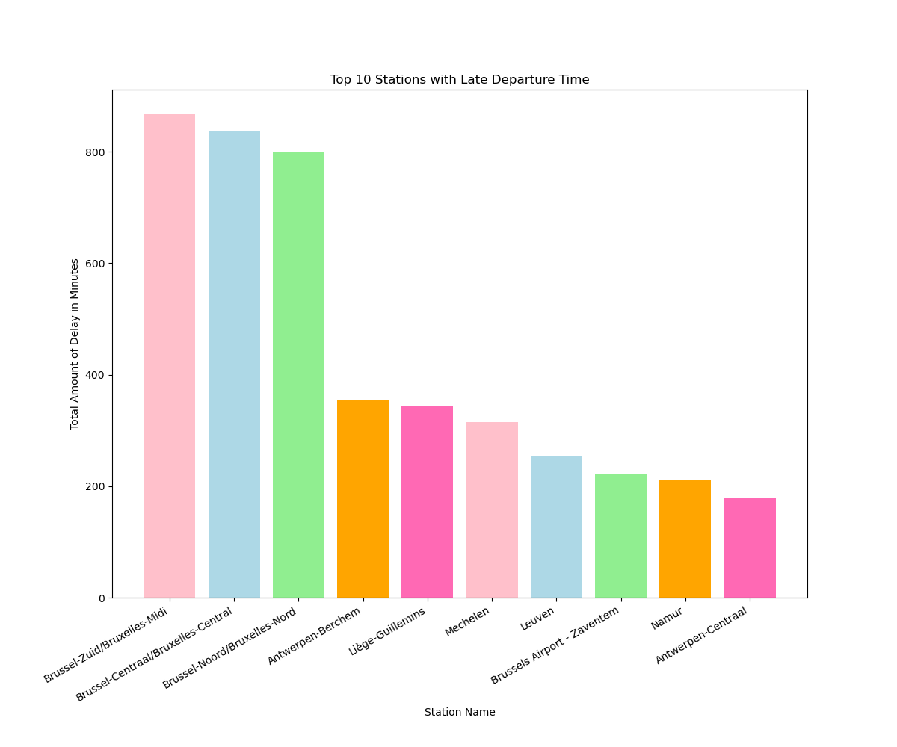

# Belgian Railway Statistics

Some information about delays and cancelations from 2023-12-10 04:01:25 until 2023-12-17 21:54:55.

## Delays

### Top  stations with late departures

| Station Name | Total Amount of Delay in Minutes |
| ------------ | -------------------------------- |
| Brussel-Noord/Bruxelles-Nord | np.float64(3863.0) |
| Brussel-Centraal/Bruxelles-Central | np.float64(2986.0) |
| Brussel-Zuid/Bruxelles-Midi | np.float64(2088.0) |
| Namur | np.float64(1941.0) |
| Gembloux | np.float64(1629.0) |
| Ottignies | np.float64(1589.0) |
| Liège-Guillemins | np.float64(1477.0) |
| Leuven | np.float64(1454.0) |
| Brussel-Schuman/Bruxelles-Schuman | np.float64(1446.0) |
| Antwerpen-Berchem | np.float64(1393.0) |

### Top  stations with late arrivals

| Station Name | Total Amount of Delay in Minutes |
| ------------ | -------------------------------- |
| Brussel-Zuid/Bruxelles-Midi | np.float64(12517.0) |
| Antwerpen-Centraal | np.float64(8173.0) |
| Arlon | np.float64(5182.0) |
| Liège-Guillemins | np.float64(4803.0) |
| Leuven | np.float64(4160.0) |
| Mechelen | np.float64(3497.0) |
| Charleroi-Central | np.float64(2901.0) |
| Gent-Sint-Pieters | np.float64(2660.0) |
| Mons | np.float64(2551.0) |
| Namur | np.float64(2462.0) |

### Top  trains with late departures

| Train Name   | Total Amount of Delay in Minutes |
| ------------ | -------------------------------- |
| BE.NMBS.IC2119 | np.float64(3677.0) |
| BE.NMBS.IC2138 | np.float64(3565.0) |
| BE.NMBS.L570 | np.float64(3053.0) |
| BE.NMBS.S11766 | np.float64(2069.0) |
| BE.NMBS.P8223 | np.float64(2033.0) |
| BE.NMBS.L4967 | np.float64(1268.0) |
| BE.NMBS.S86590 | np.float64(1048.0) |
| BE.NMBS.S322570 | np.float64(1034.0) |
| BE.NMBS.IC1820 | np.float64(1011.0) |
| BE.NMBS.L4989 | np.float64(994.0) |

## Cancelations

### Top  stations with cancelations at departure

| Station Name | Total Amount of Cancelations |
| ------------ | ---------------------------- |
| Brussel-Noord/Bruxelles-Nord | np.int64(41) |
| Liège-Guillemins | np.int64(37) |
| Brussel-Centraal/Bruxelles-Central | np.int64(28) |
| Liège-Carré | np.int64(27) |
| Oostende | np.int64(23) |
| Brugge | np.int64(20) |
| Gent-Sint-Pieters | np.int64(17) |
| Brussels Airport - Zaventem | np.int64(17) |
| Brussel-Zuid/Bruxelles-Midi | np.int64(15) |
| Statte | np.int64(14) |

### Top  trains with cancelations

| Train Name | Total Amount of Cancelations |
| ---------- | ---------------------------- |
| BE.NMBS.IC2420 | np.int64(74) |
| BE.NMBS.IC1821 | np.int64(54) |
| BE.NMBS.IC1738 | np.int64(43) |
| BE.NMBS.IC1719 | np.int64(42) |
| BE.NMBS.IC2417 | np.int64(41) |
| BE.NMBS.L4990 | np.int64(36) |
| BE.NMBS.S53688 | np.int64(36) |
| BE.NMBS.P8000 | np.int64(31) |
| BE.NMBS.IC3615 | np.int64(29) |
| BE.NMBS.IC1716 | np.int64(28) |

